# Backend Workflow Audit

**Status:** Audit only — no architecture, schema, API, or business-logic changes in this phase.  
**Date:** 2026-08-20  
**Source of truth:** Repository implementation under `apps/api` (Prisma + NestJS) and related web session routing in `apps/web`.  
**Scope:** Authentication, tenancy, authorization, onboarding, domain workflows, entitlements, workers, multi-tenancy, integrity.

Legend used throughout:

| Label | Meaning |
|---|---|
| **Implemented** | Code path exists and is wired end-to-end |
| **Partial** | Exists with known gaps or incomplete coverage |
| **Missing** | Not implemented in API/services |
| **Inconsistent** | Behavior differs across surfaces or contradicts docs |
| **Product decision** | Cannot be resolved from code alone |

---

## 1. Architecture overview

### Monorepo layout

| Path | Role |
|---|---|
| `apps/api` | NestJS REST API (`main.ts`), BullMQ worker (`worker.ts`), Prisma schema/migrations |
| `apps/web` | Next.js surfaces: marketing, `/admin`, `/orgs/:id`, `/client`, `/auth` |
| `packages/config` | Shared constants (`SESSION_COOKIE_NAME`, `FEATURE_KEYS`, roles) |
| `packages/types` | Shared TS types |
| `packages/validation` | Env schema (TTLs, `MAX_DOCUMENT_BYTES`) |
| `packages/utilities` | Email normalize, slugify, date helpers |
| `packages/nutrition` | Nutrition math |
| `packages/ui` | Shared UI |

API prefix: `api/v1` (`API_V1_PREFIX`). Session cookie: `ns_session`.

### Identity model (actual)

There is **one** `User` table. Persona is determined after registration by:

1. `User.platformRole` → platform admin (`ADMIN` / `SUPER_ADMIN`)
2. Active `OrganizationMember` → practice staff (OWNER / DIETITIAN / STAFF)
3. Active `ClientAccount` → patient portal
4. Neither → verified user who can create an org **or** redeem a join code

Registration does **not** create organizations, memberships, or client accounts.

### High-level request stack

```
HTTP → SessionGuard (cookie) → [TenantGuard] → [OrgRolesGuard | ClientAccessGuard | PlatformRolesGuard]
     → Controller → Service → Prisma (organizationId / clientId scoped)
```

Entitlements are **not** RBAC; they are feature/limit gates resolved at runtime from subscription + plan + overrides.

---

## 2. Authentication

### Code paths

| Flow | Endpoint | Service | Status |
|---|---|---|---|
| Register (all personas) | `POST /api/v1/auth/register` | `AuthService.register` | **Implemented** |
| Login | `POST /api/v1/auth/login` | `AuthService.login` | **Implemented** |
| Logout | `POST /api/v1/auth/logout` | `AuthService.logout` + cookie clear | **Implemented** |
| Me | `GET /api/v1/auth/me` | SessionGuard | **Implemented** |
| Verify email | `POST /api/v1/auth/verify-email` | `EmailVerificationService` | **Implemented** |
| Resend verification | `POST /api/v1/auth/resend-verification` | same | **Implemented** |
| Forgot password | `POST /api/v1/auth/forgot-password` | `PasswordResetService` | **Implemented** |
| Reset password | `POST /api/v1/auth/reset-password` | same (revokes all sessions) | **Implemented** |
| Revoke all sessions | `POST /api/v1/auth/sessions/revoke-all` | `SessionService.revokeAllForUser` | **Implemented** |
| Admin login | Same login; routing via `platformRole` | Web `session-home.ts` | **Implemented** |
| Dietitian-only register API | — | — | **Missing** (same register) |
| Patient-only register API | — | — | **Missing** (same register) |
| Session refresh / sliding TTL | — | — | **Missing** |

### Registration (`AuthService.register`)

1. Password policy check → bcrypt hash.
2. Create `User` with `status: PENDING`, optional `firstName`/`lastName`.
3. Optional `Consent` rows.
4. Issue email verification token + send email.
5. Duplicate email: anti-enumeration success; if existing `PENDING` + unverified, resend verification.

Does **not** set `platformRole`, create org, or create `ClientAccount`.

### Login (`AuthService.login`)

Requires all of:

- User exists
- Password valid
- `status === ACTIVE`
- `emailVerifiedAt != null`
- `SessionService.clientPortalMayAuthenticate(userId)` true

On success: create `Session` (HMAC-hashed token), set httpOnly cookie.

`clientPortalMayAuthenticate` behavior:

- No `ClientAccount` → allow
- Has active org membership → allow (even with client account row)
- Has `ClientAccount` + client not ACTIVE → deny
- Has `ClientAccount` with status `ACTIVE` or `DEACTIVATED` → allow login at auth layer  
  (portal access itself still requires ACTIVE account via `assertPortalAccess`)

### Session

| Property | Implementation |
|---|---|
| Storage | `sessions.token_hash` = HMAC-SHA256(raw, `AUTH_TOKEN_SECRET`) |
| Cookie | `ns_session`, httpOnly, SameSite=Lax, Secure in prod |
| TTL | `SESSION_TTL_SECONDS` default **7 days** (`packages/validation`) |
| Refresh | **None** — `lastUsedAt` updates; `expiresAt` does not slide |
| Revocation | `revokedAt` set; logout / password reset / portal deactivate / client archive |

### Email verification / password reset

- Tokens: HMAC hash, single-use (`usedAt`), TTL (verification default 24h; reset 1h per env defaults).
- Reset password updates hash and **revokes all sessions**.

### How the system determines persona

| Persona | Determination (code) |
|---|---|
| Platform admin | `user.platformRole ∈ {ADMIN, SUPER_ADMIN}` — `PlatformRolesGuard` |
| Organization member | Active `OrganizationMember` for `:organizationId` — `TenantGuard` |
| Patient (joined) | `ClientAccount` ACTIVE + `Client` ACTIVE + **no** active org membership — `ClientAccessService.assertPortalAccess` |
| Unjoined patient | Authenticated, no `platformRole`, no active membership; `/portal/onboarding` → `needs_join` |
| Dietitian without org | Verified user; creates org via `POST /organizations` → OWNER |

Frontend home routing: `apps/web/lib/session-home.ts` — admin → `/admin`; org memberships → `/orgs/...`; else portal onboarding → `/client` or `/client/join`.

### Admin login

There is **no** separate admin auth endpoint. Admins use the same login; `platformRole` must already be set (by SUPER_ADMIN via admin API, or manual DB — **no in-repo seed for first SUPER_ADMIN found**).

---

## 3. User / organization relationships

```text
User
 ├─ platformRole? ──────────────────────────► Platform admin
 ├─ OrganizationMember[] (multi-org OK)
 │    └─ role: OWNER | DIETITIAN | STAFF
 ├─ ClientAccount? (userId @unique, clientId @unique)
 │    └─ Client (belongs to one Organization)
 │         └─ ClientAssignment[] (soft history via unassignedAt)
 └─ Session[], tokens, consents, …
```

### Relationship rules (as implemented)

| Question | Answer from code |
|---|---|
| Who can create organizations? | Any authenticated session user via `POST /organizations` — **no** check blocking `ClientAccount` or `platformRole` |
| Who can create users? | Self via register; no admin “provision user with password” API beyond status/role updates |
| Who can create clients? | OWNER / DIETITIAN (`assertCanCreate`); STAFF forbidden; also practice join creates Client |
| Who can invite/connect clients? | OWNER / DIETITIAN (`invite` action); practice or per-client join codes |
| Who can assign dietitians? | OWNER / DIETITIAN (`assign`); replaces active assignment (one active at a time by convention) |
| Cross-org data access? | Blocked by `TenantGuard` + `organizationId` in queries for tenant routes; portal scoped to own `ClientAccount` |
| User in multiple orgs? | **Supported** — `listForUser` returns all ACTIVE memberships; web routes to `/orgs` picker if >1 |
| Patient in multiple practices? | **Not supported** — `ClientAccount.userId` and `clientId` are both `@unique` (1:1:1 user↔client↔account) |
| Ownership rules | OWNER: all clients; settings; members; transfer; archive org |
| Staff rules | Assigned clients only; cannot create/archive/assign/invite clients; cannot manage recipes/overrides/automations/task-create |
| Dietitian rules | Assigned clients (+ invite/assign/create); recipes, food overrides, automations |

### Ambiguous / unsafe behavior

1. **Org create does not block portal users or admins** — unlike membership add (blocks `ClientAccount`) and portal join (blocks membership/`platformRole`). **Inconsistent.**
2. **Dual rows possible at DB level** — user can have both `OrganizationMember` and `ClientAccount`; app mostly prevents mutual use, but no DB constraint.
3. **Practice join auto-assigns** to join-code creator if that user is ACTIVE OWNER/DIETITIAN in the org — may leave patient unassigned if creator left/deactivated.
4. **New org has no Subscription** — entitlements deny until admin assigns ACTIVE subscription (including `CLIENT_LIMIT`).

---

## 4. Authorization matrix

### Guard stack

| Guard | File | Behavior |
|---|---|---|
| `SessionGuard` | `auth/guards/session.guard.ts` | Cookie → validate session → `req.user` |
| `PlatformRolesGuard` | `admin/guards/platform-roles.guard.ts` | Requires `platformRole`; optional `@PlatformRoles` narrows |
| `TenantGuard` | `organizations/guards/tenant.guard.ts` | ACTIVE membership + org status ACTIVE |
| `OrgRolesGuard` | `organizations/guards/org-roles.guard.ts` | `@OrgRoles(...)` must match; no metadata → allow |
| `ClientAccessGuard` | `clients/guards/client-access.guard.ts` | `@ClientActionRequired` + `ClientAccessService` |
| `ThrottlerGuard` | auth / portal join / messaging / upload / AI | Rate limits |

### Permission matrix (implementation)

| Action | Admin | Owner | Dietitian | Staff | Patient |
|---|:---:|:---:|:---:|:---:|:---:|
| Register / login | ✓* | ✓ | ✓ | ✓ | ✓ |
| Platform admin APIs | ✓ | — | — | — | — |
| Create organization | △ | ✓ | ✓ | ✓ | △ |
| Manage org settings / members | ✓† | ✓ | — | — | — |
| Archive organization | ✓† | ✓ | — | — | — |
| Create client | — | ✓ | ✓ | — | via practice join |
| Update / read assigned client | — | ✓ all | ✓ assigned | ✓ assigned | own |
| Archive / restore client | — | ✓ | ✓ assigned | — | — |
| Assign dietitian | — | ✓ | ✓ | — | — |
| Issue join code | — | ✓ | ✓ | — | — |
| Deactivate portal account | — | ✓ | ✓ | — | — |
| Recipes / food overrides | — | ✓ | ✓ | — | read foods only |
| Meal plans write | — | ✓ | ✓ assigned | ✓ assigned‡ | — |
| Meal plan read published | — | ✓ | ✓ | ✓ | ✓ published only |
| Tracking write | — | — | — | — | ✓ own |
| Tracking read | — | ✓ | ✓ | ✓ | ✓ own |
| Appointments write | — | ✓ | ✓ | ✓‡ | — (**no portal API**) |
| Messaging | — | ✓ | ✓ | ✓ | ✓ |
| Documents upload / visibility | — | ✓ | ✓ | ✓ (read) | SHARED only |
| Documents archive | — | ✓ | ✓ | — | — |
| Invoices CRUD / pay mark | — | ✓ | ✓ | ✓‡ | read non-draft |
| Tasks create | — | ✓ | ✓ | — | — |
| Tasks update assigned | — | ✓ | ✓ | ✓ | — |
| AI | — | ✓ | ✓ | ✓‡ | — |
| Automations manage | — | ✓ | ✓ | — | — |
| Assign subscription / plans | ✓ | — | — | — | — |

\*Admin uses same auth; needs `platformRole`.  
†Admin via `/admin/organizations` status, not OWNER routes.  
‡Uses `manageRecords` or default `read` — STAFF with assignment allowed.  
△Allowed by API if session exists; product may not intend portal/admin org creation.

### Authorization flags

| Severity | Issue |
|---|---|
| P1 | STAFF can create appointments, invoices, meal-plan records, use AI, message, upload docs — confirm intent |
| P1 | Document upload/visibility authorized with `read`, not `manageRecords` |
| P0 (ops) | No ACTIVE subscription → `CLIENT_LIMIT` denied → cannot create clients / practice join |
| P2 | Org create missing portal/admin exclusion |
| OK | Lists use `visibleWhere` (OWNER all; others assignment-filtered) |
| OK | Client lookups include `organizationId` — UUID alone insufficient |
| Partial | Docs mention `auth/invitations/preview\|accept` — **not in** `auth.controller.ts` |

---

## 5. Patient onboarding / join-code workflow

### Intended concept (from product notes)

Patient self-registers → verifies email → logs in → enters practice join code → `ClientAccount` connected → portal.

### Actual implementation

Join codes are **`InvitationToken`** rows with `purpose = CLIENT_INVITE`, not a separate JoinCode table.

| Step | Implementation |
|---|---|
| Code generation | `TokenService.generateJoinCode` — 8 chars from Crockford-like alphabet, display `XXXX-XXXX` |
| Hashing | HMAC-SHA256 via `hashToken` (`AUTH_TOKEN_SECRET`); store `tokenHash` |
| Hint | Last 4 of normalized code stored in `emailNormalized` field (repurposed) |
| TTL | `INVITATION_TTL_SECONDS` default **7 days** |
| Practice code | `clientId = null`, org-bound; **multi-use** (not consumed on join) |
| Client-specific code | `clientId` set; **single-use** via `invitations.consume` |
| Regeneration | Delete unused invites → issue new |
| Revocation | Delete unused invites |
| Redemption | `POST /api/v1/portal/join` (SessionGuard + auth throttle) |
| Throttling | Auth throttler on join |
| Session required | Yes |
| Org binding | `invitation.organizationId` required |
| Client binding | Optional; null = practice self-serve create |

### After redemption

**Practice code** (`joinPractice`):

1. Enforce client limit entitlement.
2. Create `Client` + `ClientProfile` + optional `ClientAssignment` to code creator + `ClientAccount` ACTIVE.
3. Timeline events; security audit.
4. **Does not** mark invitation `usedAt`.

**Client-specific code** (`joinExistingClient`):

1. Link/activate `ClientAccount`; promote client `PENDING` → `ACTIVE` if needed.
2. `consume` invitation (single-use).

### Edge cases (code behavior)

| Scenario | Behavior |
|---|---|
| Code expired | `JOIN_CODE_EXPIRED` |
| Code revoked (deleted) | `JOIN_CODE_INVALID` |
| Client code reused | `JOIN_CODE_USED` |
| Practice code reused | Allowed until revoke/expiry/limit |
| Wrong person's client code | If client already has another user → `CLIENT_ACCOUNT_EXISTS` |
| Patient already connected elsewhere | `JOIN_ALREADY_CONNECTED` (unique userId) |
| Patient has DEACTIVATED account same org | Practice join can reactivate via `activateExistingAccount` |
| Org member / admin tries join | `JOIN_NOT_ALLOWED` |
| Client already has ACTIVE account | Conflict on generate and on join |

### Match to intended workflow

| Aspect | Match? |
|---|---|
| Self-register → verify → login → join | **Yes** |
| Practice join creates client | **Yes** |
| One-time practice code | **No** — practice codes are reusable |
| Email-bound invite accept API | **Missing** (`STAFF_INVITE` / `DIETITIAN_ACTIVATION` enum values unused in live flows) |

---

## 6. Patient lifecycle

```text
No user
 → Register (PENDING) → Verify (ACTIVE)
 → [optional] needs_join
 → Redeem practice code OR client-specific code
 → Client (+ profile) + ClientAccount ACTIVE [+ assignment]
 → Dietitian assigns/reassigns (ClientAssignment)
 → Published meal plan visible
 → Patient tracks food/water/exercise/sleep/habits
 → Messaging / SHARED documents / issued invoices
 → Portal deactivate OR client archive
 → Sessions revoked; portal access denied
```

| Stage | Records | Notes |
|---|---|---|
| Created by practice | Client, ClientProfile, optional assignment | Status ACTIVE or PENDING |
| Portal connect | ClientAccount | 1:1 user↔client |
| Assigned | ClientAssignment | Soft history; one active by service convention |
| Plan received | MealPlan + PUBLISHED version | Portal reads published only |
| Tracking | `*_logs` with org+client | Soft archive on delete |
| Messaging | Conversation (1 per client) + Messages | Soft delete messages via `deletedAt` |
| Documents | Document rows + filesystem | SHARED visible to portal |
| Invoices | Invoice statuses | Portal sees ISSUED/SENT/PAID/OVERDUE |
| Appointments | Appointment rows | **No patient portal endpoints** |
| Disconnect | ClientAccount DEACTIVATED | Sessions revoked |
| Archive client | Client ARCHIVED; assignments closed; account deactivated; sessions revoked | Restore does **not** auto-reactivate portal |

### Missing lifecycle states

- Explicit “transferred to another practice” (**impossible** with 1:1 ClientAccount)
- Patient-initiated disconnect API (**Missing** — only practice deactivate)
- Patient appointment visibility (**Missing**)
- Soft “paused” portal without DEACTIVATED (**Missing** — only PENDING/ACTIVE/DEACTIVATED)
- Multi-dietitian concurrent assignment (**Partial** — schema allows multiple `unassignedAt: null` rows; service tries to keep one)

---

## 7. Dietitian lifecycle

### Onboarding

1. Register → verify → login.
2. `POST /api/v1/organizations` → Organization ACTIVE + Settings + Membership OWNER.
3. **No subscription created** — admin must `PUT /admin/organizations/:id/subscription`.
4. Practice setup via settings PATCH (OWNER).
5. Optional: generate practice join code; add members by email (must already be ACTIVE verified users).

### Per-domain workflow summary

| Domain | Who initiates | DB created | Auth | On failure / delete |
|---|---|---|---|---|
| Clients | OWNER/DIETITIAN or practice join | Client, Profile, optional Assignment | Tenant + create/limit | Archive soft; Restrict FK |
| Assignments | OWNER/DIETITIAN | ClientAssignment | `assign` | Soft unassign |
| Meal plans | OWNER/DIETITIAN/STAFF‡ | Plan, Version DRAFT, days/meals/items | ClientAccess manageRecords | Soft archive; publish freezes |
| Recipes | OWNER/DIETITIAN | Recipe + ingredients | OrgRoles | Soft archive |
| Foods | Platform catalog + org overrides | FoodOverride | OWNER/DIETITIAN write | Override INACTIVE |
| Tracking | Patient writes; staff reads | Logs | Portal vs ClientAccess read | Soft ARCHIVED |
| Appointments | Staff | Appointment + timeline | manageRecords | Status cancel/complete/no-show |
| Messaging | Either side | Conversation, Message, Notification | read access | Message `deletedAt` |
| Documents | Either side | Document + file | read / archive | Soft ARCHIVED; file retained |
| Invoices | Staff | Invoice, items, sequence | manageRecords | Soft archive; status machine |
| Tasks | OWNER/DIETITIAN (+ automation) | Task | STAFF cannot create | Soft archive |
| Analytics | Members | Reads only | Tenant + visibleWhere | — |
| AI | Members with client access | AiRequest, AiUsage | Entitlement + throttle | No clinical mutation |
| Automations | OWNER/DIETITIAN | Rule, Runs, Usage | Entitlement | Soft archive rule |

---

## 8. Admin lifecycle

### Surfaces (`/api/v1/admin/*` + SessionGuard + PlatformRolesGuard)

| Area | Capability | Status |
|---|---|---|
| Me | `GET /admin/me` | **Implemented** |
| Users | List/get; set ACTIVE/SUSPENDED/ARCHIVED; set platformRole (SUPER_ADMIN only) | **Implemented** |
| Organizations | List/get; set status; entitlements view; AI/automation summaries | **Implemented** |
| Subscriptions | PUT assign plan; PATCH status | **Implemented** |
| Feature overrides | PUT/DELETE per org+feature | **Implemented** |
| Plans / features catalog | CRUD plans/features; set plan features | **Implemented** |
| Audit list | `GET /admin/audit` | **Implemented** |
| Subscriptions list | `GET /admin/subscriptions` | **Implemented** |
| Food DB | Read-only food **sources** metadata | **Partial** — no admin food CRUD API (import via CLI) |
| Site settings | GET/PATCH admin; public GET | **Implemented** |
| System health | `GET /health` (public) | **Implemented** |
| Provision account + assign to user | Create user + password + org + subscription in one flow | **Missing** |
| Disable self-registration | Feature flag / env gate | **Missing** |

### Conflict with future direction

> Platform admin should eventually provision accounts and assign them to users. Self-registration will eventually be disabled.

**Phase 3 update (2026-08-20):** Implemented. `registrationEnabled` defaults to `false`; admin `POST /api/v1/admin/dietitians` provisions User + DietitianAccount + optional subscription + `DIETITIAN_ACTIVATION` email. Self-serve register/org create are gated. See [TENANCY_MIGRATION.md](./TENANCY_MIGRATION.md).

**Phase 4 (done):** subscription lifecycle enforcement — see [TENANCY_MIGRATION.md](./TENANCY_MIGRATION.md).

**Phase 5 (done):** dashboards + notifications + product email gate.

**Phase 6 (done):** client portfolio aggregate, chart tab IA, timeline pagination, assessment GET-by-id, portal `me` profile enrichment. Profile photo upload still deferred.

**Phase 7 (done):** practice APIs remounted to `/api/v1/dietitian/:dietitianAccountId`; `DietitianGuard` + `DietitianTenantContext`; Organization dual-write stopped; `organizationId` / Organization / OrganizationMember / OrganizationSettings removed after backfill; admin at `/admin/dietitians`; web clients updated. Remount complete — no further Organization tenancy shell.

What must change later (audit only):

1. Gate or remove public `POST /auth/register` (or audience-specific). ✅ Phase 3
2. Admin APIs to create users (with invite/activation), create orgs, attach OWNER, assign ACTIVE subscription. ✅ Phase 3
3. Replace or wrap self-serve `POST /organizations`. ✅ Phase 3 (gated)
4. Possibly replace practice self-serve join with provisioned client accounts.
5. Bootstrap story for first SUPER_ADMIN (currently unclear in-repo).
6. Staff/dietitian invite purposes already in schema (`STAFF_INVITE`, `DIETITIAN_ACTIVATION`) but unused — likely vehicle for provisioned activation. ✅ `DIETITIAN_ACTIVATION` wired in Phase 3

---

## 9. Subscriptions / entitlements

### Model

```text
Organization 1──1 Subscription → Plan → PlanFeature → Feature
                     └─ FeatureOverride (per org, wins over plan)
```

There is **no** `Entitlement` table. Resolution: `EntitlementService.resolve`.

### Resolution rules

1. Feature must exist and be `ACTIVE`, else deny.
2. Subscription must exist and be `ACTIVE`, else deny.
3. Override if present: `enabled`/`limitValue` (null fields fall back to plan).
4. Else plan feature; else deny.

### Seeded catalog (`catalog.seed.ts`)

| Plan | AI | AI limit | Client limit | Automation | Rule limit | Exec limit |
|---|---|---|---|---|---|---|
| standard | off | 0 | unlimited (null) | off | 0 | 0 |
| pro | on | 300/mo | unlimited | on | 25 | 2000 |
| premium | on | 1000/mo | unlimited | on | 100 | 10000 |

**Important:** “unlimited client limit” still requires an **ACTIVE subscription**. Org without subscription → `CLIENT_LIMIT` denied.

### Enforcement points (backend)

| Feature key | Enforced in |
|---|---|
| `CLIENT_LIMIT` | `client.service` create; `client-account.service` practice join |
| `AI` / `AI_REQUEST_LIMIT` | `ai.service` (+ usage reservation) |
| `AUTOMATION` / rule & exec limits | `automation.service`, `automation-executor`, `automation-usage` |

### Not entitlement-gated (by design)

Messaging, documents, invoices, tasks, tracking, recipes, meal plans, appointments, assessments.

### Enforcement quality

| Kind | Finding |
|---|---|
| Backend | Core gates present for AI/automation/clients |
| Frontend-only | UI may hide features; must not be trusted — backend is source of truth |
| Missing | No automatic EXPIRED handling when `currentPeriodEnd` passes (status must be set manually/admin) |
| Missing | No Stripe/webhook billing automation (`provider`/`externalId` fields exist unused) |
| Inconsistent | New org usable for non-gated features even without subscription |

---

## 10. Multi-tenancy / data ownership

### Boundary rule

`tenantWhere(organizationId)` comment: **UUIDs are not a security boundary** — queries must include `organizationId`.

### Per-entity ownership

| Entity | Ownership | Cross-org access possible? |
|---|---|---|
| Organization | Root tenant | No (membership required) |
| Client | `organizationId` Restrict | No if services use tenant scope |
| ClientAccount | user + client unique; denormalized `organizationId` **without FK** | Bound to one client/org |
| MealPlan / Recipe | Org (+ client for plans) | No |
| Food | Global catalog | Shared read; overrides per org |
| FoodOverride | Org | No |
| Tracking logs | Org + client | No |
| Conversation / Message | Org + client (1 conversation/client) | No |
| Document | Org + client + storage key | No (path includes org/client) |
| Invoice / Task | Org (+ optional client) | No |
| Appointment | Org + client | No |
| AutomationRule / Run | Org | Worker skips inactive orgs |
| AiRequest / AiUsage | Org | No |
| Notification | `userId` + stored `organizationId` **no Org FK** | Isolated by userId checks |
| Platform Food / Plan / Feature | Global | Admin |

### Isolation flags

| Issue | Severity |
|---|---|
| `ClientAccount.organizationId` no Prisma relation/FK | P2 integrity |
| `Notification.organizationId` no FK | P2 |
| Practice join code reuse across strangers until limit | P1 abuse |
| Assignment query in `assign` filters `unassignedAt: null` without forcing `organizationId` on findFirst current — mitigated by clientId uniqueness across orgs being UUID global | Low if IDs unguessable; still prefer explicit org filter |

---

## 11. Delete / archive / deactivate behavior

| Action | Behavior |
|---|---|
| User SUSPENDED/ARCHIVED (admin) | Status + timestamps; sessions fail validation (non-ACTIVE) |
| User hard delete | Not exposed; FKs Cascade on sessions/tokens; Restrict on ClientAccount |
| Organization ARCHIVED/SUSPENDED | `OrganizationLifecycleService`; TenantGuard blocks non-ACTIVE |
| Organization hard delete | Not exposed; most clinical FKs Restrict |
| Client ARCHIVED | Assignments closed; portal DEACTIVATED; sessions revoked; data retained |
| Client restore | Status restored; **portal not auto-reactivated**; assignments not restored |
| Portal deactivate | Account DEACTIVATED; sessions revoked |
| Member deactivate | Membership DEACTIVATED; loses TenantGuard; assignments remain until reassigned |
| Dietitian reassigned | Previous assignment `unassignedAt`; new row |
| Message delete | Soft `deletedAt` |
| Document / recipe / meal plan / invoice / task / automation | Soft archive |
| Auth tokens | Hard deleted when regenerating unused invites; Cascade with user |

### Orphans / history

- Filesystem document files are **not** deleted on archive (**orphan files possible**).
- Timeline + AuditLog retained (SetNull actors).
- Assignment history retained.

---

## 12. Messaging

### Flow

1. Lazy `Conversation` per client (`clientId` unique).
2. `sendMessage` creates `Message`, updates conversation, creates `NEW_MESSAGE` notifications for recipients.
3. Org → patient: notify portal user; Patient → org: notify assigned member user IDs.
4. Read state: `ConversationReadState` per reader.
5. Polling: client-driven GET endpoints (no websocket).

### Auth

- Org: Tenant + ClientAccess `read` (STAFF allowed if assigned).
- Portal: `assertPortalAccess`.
- Inbox list filtered by `visibleWhere` client IDs.

### Gaps

| Gap | Status |
|---|---|
| Real-time push | **Missing** |
| Typing / presence | **Missing** |
| Hard delete conversation | Soft ARCHIVED status exists; limited ops |
| Messaging when no assignee | Patient send may notify empty set — **Partial** |
| Cross-org | Prevented |

---

## 13. Documents

| Step | Implementation |
|---|---|
| Upload | Multipart → magic-byte MIME check → write under `FILE_STORAGE_PATH` |
| Storage key | `organizations/{orgId}/clients/{clientId}/{documentId}.{ext}` |
| DB | `documents` row; unique `(organizationId, storageKey)` |
| Max size | `MAX_DOCUMENT_BYTES` default **20MB** |
| Allowed types | PDF, JPEG, PNG, WebP, DOCX |
| Auth download | Org: client access; Portal: SHARED only (else 404) |
| Visibility | INTERNAL / SHARED; archive forces INTERNAL |
| Deletion | Soft ARCHIVED; **file retained** |
| Orphan files | Possible if DB archive without file unlink |

Portal uploads forced SHARED. Org default INTERNAL unless specified.

---

## 14. Meal plans / recipes / foods

### Ownership

- **Foods**: global (`Food` + `FoodSource`); org **overrides** via `FoodOverride`.
- **Recipes**: org-scoped; OWNER/DIETITIAN mutate.
- **Meal plans**: org + client; versions DRAFT → PUBLISH.

### Publish behavior (`meal-plan.service.publish`)

1. Only DRAFT can publish.
2. Requires at least one food/recipe item.
3. Transaction: supersede previous PUBLISHED → set version PUBLISHED + `publishedAt`.
4. Nutrition snapshot frozen on publish path.
5. Portal `GET /portal/meal-plan` returns latest PUBLISHED only — **patients cannot see drafts**.

### Risks

| Risk | Mitigation / gap |
|---|---|
| Patient sees draft | Mitigated — portal filters PUBLISHED |
| Wrong org recipe in plan | Items resolved in org context — rely on service checks |
| Food override vs global | Org reads merge overrides — confirm all read paths use override service |

---

## 15. Tracking

| Log | Portal write | Org read | Uniqueness |
|---|---|---|---|
| Food | ✓ | ✓ | — |
| Water | ✓ | ✓ | — |
| Exercise | ✓ | ✓ | — |
| Sleep | ✓ | ✓ | `(org, client, date)` |
| Habits | ✓ | ✓ | `(org, client, habitKey, logDate)` |

- Patient creates via `/api/v1/portal/tracking/*`.
- Dietitian reads via `/organizations/:orgId/clients/:clientId/tracking/*` (GET only).
- Deletes → status ARCHIVED + `archivedAt`.
- Food logs store nutrition snapshot.
- Isolation: orgId + clientId + portal assert / ClientAccess.

---

## 16. Appointments

| Capability | Status |
|---|---|
| Create / list / patch status | **Implemented** (org side) |
| Statuses | SCHEDULED, COMPLETED, CANCELLED, NO_SHOW |
| Patient visibility API | **Missing** |
| Calendar sync / external calendar | **Missing** (do not invent) |
| Reminders | Settings fields `reminderEmailEnabled` / `reminderHoursBefore` — automation trigger `APPOINTMENT_UPCOMING` can notify; dedicated reminder worker **Partial** |
| Ownership | `organizationId` + `clientId` + optional member |

---

## 17. Invoices

### Status machine (implemented)

```text
DRAFT → ISSUED → SENT → PAID
                 ↘ OVERDUE (batch helper)
Any unpaid open → CANCELLED (not from PAID)
```

| Aspect | Implementation |
|---|---|
| Numbering | `InvoiceSequence` per org |
| Amounts | Integer minor units via `invoice-money` helpers |
| Payment processor | **Missing** — `pay` marks PAID manually |
| Portal | List/detail for ISSUED/SENT/PAID/OVERDUE |
| Send | Email + in-app notification |
| Print | Org print endpoint |
| UI-only statuses | Uncertain without web audit — backend transitions are real |

---

## 18. AI

| Aspect | Implementation |
|---|---|
| Entitlement | `AI` boolean + `AI_REQUEST_LIMIT` |
| Usage | `AiUsage` reserve per period; reject at limit |
| Actions | CLIENT_SUMMARY, MEAL_PLAN_ASSISTANCE, NUTRITION_ASSISTANCE, CONSULTATION_SUMMARY, MESSAGE_DRAFT |
| Flow | Context build → reserve → AiRequest row → provider → JSON schema validate → COMPLETED/FAILED |
| Storage | `AiRequest` audit; does **not** write clinical records |
| Portal AI | **Missing** |
| Isolation | Tenant + ClientAccess; context loaded for that client/org |
| Provider | Configurable; mock provider exists; runtime may be disabled |

---

## 19. Automations

### Lifecycle

```text
Create rule (entitlement + rule limit)
 → Activate
 → Worker sweep (every 5m) evaluates triggers
 → Candidate → Executor
 → Idempotent AutomationRun unique (organizationId, triggerKey)
 → Action (notify / email / task / client notify)
 → SUCCEEDED | FAILED | SKIPPED
```

| Piece | Detail |
|---|---|
| Triggers | APPOINTMENT_UPCOMING/MISSED, CLIENT_INACTIVE, MEAL_PLAN_ENDING, INVOICE_OVERDUE, TASK_DUE, CLIENT_CHECKIN_DUE, SCHEDULED_DATE_TIME |
| Actions | In-app notify, email, create task, client notification |
| Queue | BullMQ `automation`, job `sweep` |
| API process | Does **not** consume queue |
| Worker | `apps/api/src/worker.ts` + `AutomationWorkerModule` |
| Idempotency | Unique triggerKey; P2002 race → return; FAILED retries up to 3 |
| Auth | STAFF denied manage; entitlements on create/activate/execute |
| Org isolation | Rules scoped by org; skip inactive org/client |

### Risks

| Risk | Notes |
|---|---|
| Duplicate execution | Largely mitigated by unique triggerKey + race catch |
| Lost sweeps if worker down | Jobs delayed until worker up |
| Email action without recipient | Fails run with `recipient_email_missing` |

---

## 20. Background jobs / Redis

| Queue | Producer | Consumer | Purpose |
|---|---|---|---|
| `automation` | Worker bootstrap repeatable + manual | Worker | Sweep evaluate/execute |
| `system` | `WorkerRuntimeService` | Worker | Smoke/health style jobs |

| Topic | Behavior |
|---|---|
| Redis | `RedisService` (ioredis); health ping |
| Retry | Automation run-level retryCount ≤ 3; BullMQ job opts per queue service |
| Failed jobs | Run status FAILED; logger warn |
| Duplicate protection | DB unique + early return |
| Production | Separate worker process required for automations |

---

## 21. Notifications

| Mechanism | Used by |
|---|---|
| In-app `notifications` table | Messaging, documents, invoices, tasks, automations, appointments, client join, subscription access |
| Email (auth) | Verification, password reset, dietitian activation — **always send** |
| Email (product) | Invoice send, automation `SEND_EMAIL` — gated by `PlatformSettings.emailNotificationsEnabled` (default **false**) |
| Worker-based | Automation sweep → executor → notify/email |
| Push/SMS | **Missing** |

Endpoints: list / unread-count / mark-read / **read-all** on org-messaging and portal-messaging controllers (scoped by `userId` + `dietitianAccountId`). Practice + portal shells poll unread; no WebSockets in Phase 5.

---

## 22. API consistency

| Issue | Examples |
|---|---|
| Docs vs code | `auth/invitations/preview|accept` documented historically; not in controller |
| Error shape | Global filter: `{ statusCode, message, error }` — mostly consistent |
| 403 vs 404 | Client miss often **Forbidden** (access denied) — intentional anti-enumeration |
| Validation | DTOs + class-validator on many routes; some body shapes inline |
| Duplicated limit logic | `assertClientLimit` in both client + client-account services |
| Frontend business rules | Session home audience routing; join UX — must not replace backend gates |
| Status codes | AI limit → 429; entitlements → 403 |

---

## 23. Database integrity

| Finding | Severity |
|---|---|
| `ClientAccount.organizationId` indexed, **no FK** to Organization | P1 integrity |
| `Notification.organizationId` **no FK** | P2 |
| No DB constraint preventing User having both membership + client account | P1 product/security |
| No unique “one active assignment per client” partial index | P2 race |
| Practice invite multi-use by design (no consume) | Product |
| Join code race: unique on `tokenHash` with retry loop | OK |
| Practice join client create vs CLIENT_LIMIT race | Possible overshoot under concurrency — **Partial** |
| Cascade vs Restrict generally aligned with soft-archive policy | OK |
| Subscription 1:1 org | OK |
| Conversation 1:1 client | OK |

---

## 24. End-to-end diagrams

### Dietitian onboarding

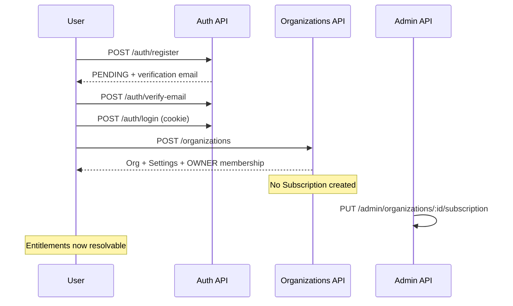

### Patient onboarding

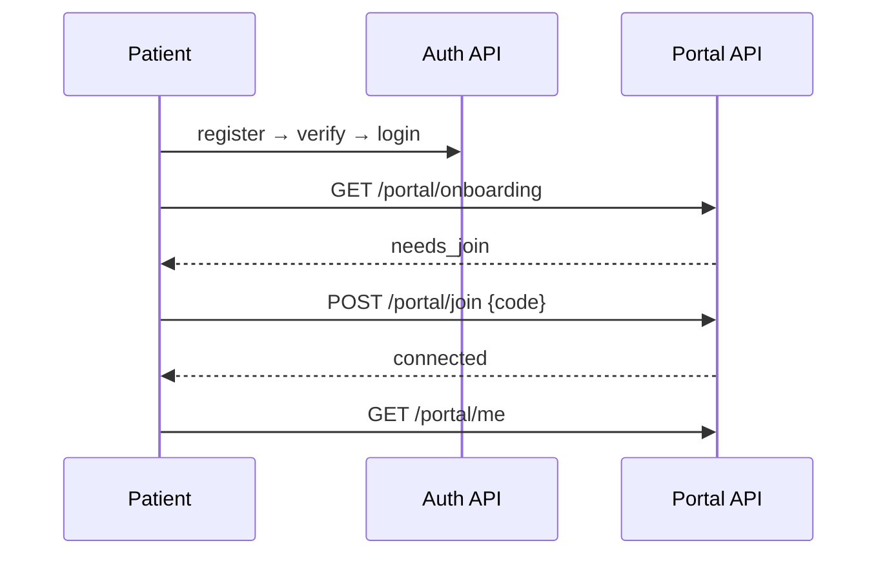

### Patient join-code connection

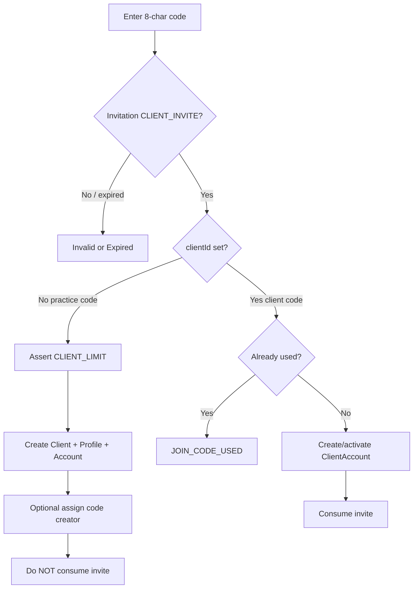

### Client lifecycle

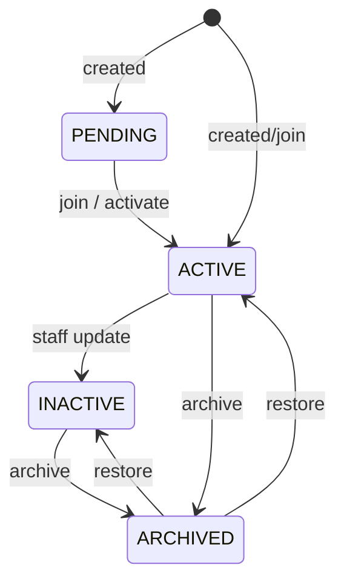

### Meal plan lifecycle

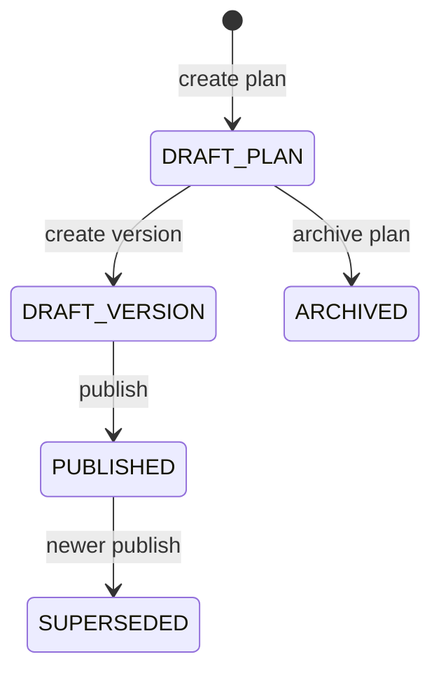

### Messaging

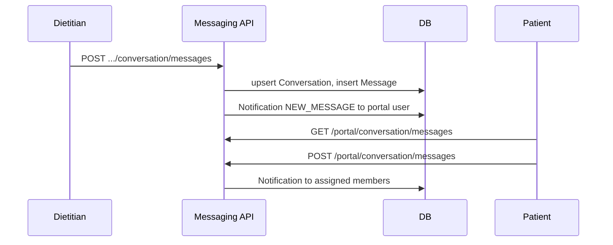

### Documents

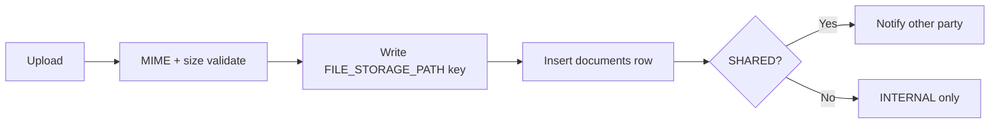

### Invoice

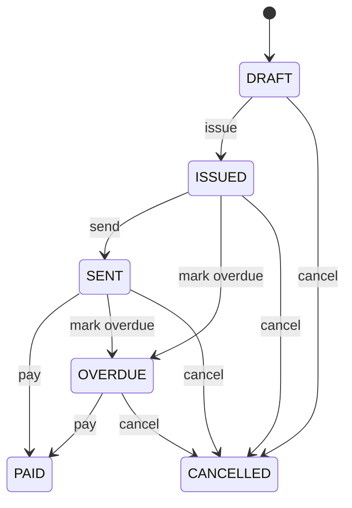

### Automation execution

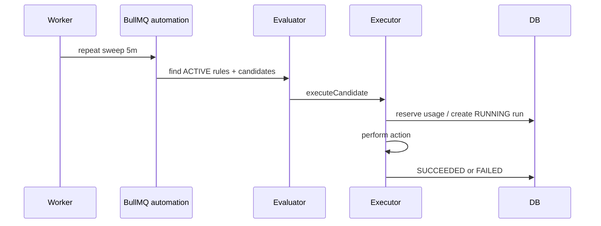

### Subscription / entitlement resolution

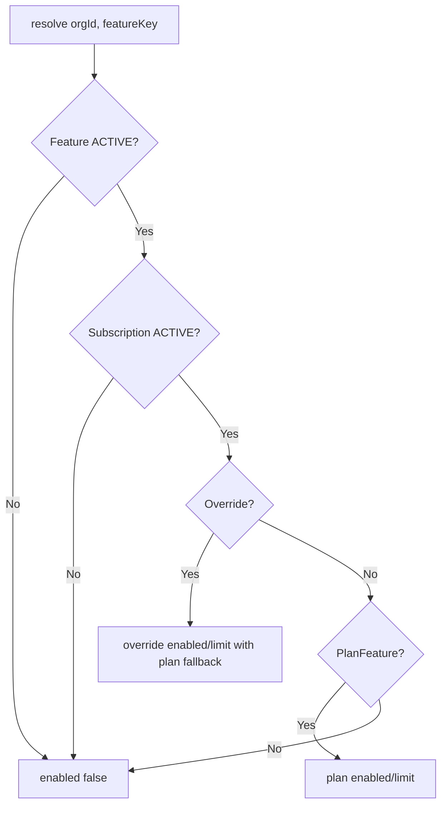

### Admin provisioning (current vs future)

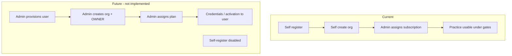

---

## 25. Problems / priorities

| Priority | Area | Problem | Current behavior | Desired behavior | Backend change needed? |
|---|---|---|---|---|---|
| P0 | Entitlements | New orgs have no subscription | Client create / practice join denied | Explicit provision path or default trial sub | Yes |
| P0 | Tenancy integrity | `ClientAccount.organizationId` lacks FK | Denormalized trust | FK + consistency checks | Yes |
| P0 | AuthZ model | Dual membership+clientAccount possible | App-level only | Enforce exclusive persona | Yes |
| P1 | Join codes | Practice codes multi-use | Anyone with code can join until limit | Product: one-time / rate / bind email? | Likely |
| P1 | Admin future | Self-serve register + org create | Open registration | Admin provisioning; disable self-reg | Yes |
| P1 | Staff permissions | Broad manageRecords/AI/docs | STAFF ≈ junior clinician | Confirm or narrow | Maybe |
| P1 | Patient appointments | No portal API | Patients cannot see appointments | Portal read (if product wants) | Yes if desired |
| P1 | Docs drift | Invitation preview/accept APIs | Documented elsewhere, missing | Align docs or implement | Docs and/or code |
| P1 | Billing | No period expiry automation | Status manual | Expire/suspend job | Yes |
| P2 | Org create gates | Portal/admin can create orgs | Allowed | Block non-practice personas | Yes |
| P2 | Client restore | Portal stays deactivated | Manual reconnect | Defined reactivation policy | Yes |
| P2 | Assignments | No unique active assignment | Race possible | Partial unique index | Yes |
| P2 | Documents | Archive leaves files | Orphan files | Delete or GC policy | Yes |
| P2 | Unused invites | STAFF_INVITE / DIETITIAN_ACTIVATION | Enum only | Real invite flows | Yes |
| P2 | Session UX | No sliding refresh | Fixed 7d expiry | Optional refresh | Maybe |
| P3 | Notifications | No push | Polling only | Optional push | Later |
| P3 | Food admin | Read-only sources API | CLI import | Admin CRUD if needed | Later |
| P3 | Invoices | Manual pay only | No PSP | Integrate payments | Later |

---

## 26. Questions requiring product decisions

Only questions that **cannot** be answered from the repository:

1. **Admin provisioning model:** Exact flow for creating users, orgs, OWNER assignment, credentials delivery, and whether existing self-registration is fully removed or kept as fallback?
2. **Practice join code policy:** Remain reusable practice codes, switch to one-time codes, email-bound invites, or pre-created client records only?
3. **Can one dietitian belong to multiple organizations?** (Code allows it — is that desired long-term?)
4. **Patient multi-practice:** Permanently forbidden, or must the 1:1 `ClientAccount` model change later?
5. **Who owns patient-generated data** (tracking, uploads) if the patient disconnects or the practice archives them — retain forever, export, purge after N days?
6. **Patient disconnect:** May patients disconnect themselves, or only the practice?
7. **Reassignment / covering dietitians:** Single assignee only, or multiple concurrent assignees with shared inbox?
8. **STAFF role intent:** Should STAFF create invoices/appointments/meal plans and use AI, or be read-only assistants?
9. **Subscription on org create:** Auto-attach trial/standard ACTIVE plan, require admin before any use, or allow ungated features without a plan?
10. **When subscription expires/suspends:** ✅ Phase 4 — derived ACTIVE → GRACE (3d) → READ_ONLY (7d) → LOCKED; TenantGuard enforces; patients keep historical portal access; joins blocked when LOCKED; automations skip READ_ONLY/LOCKED. Phase 5 emits deduped `SUBSCRIPTION_*` in-app notifications.
11. **CLIENT_LIMIT defaults:** ✅ Phase 4 — standard 25 / pro 100 / premium 300 (seed upsert).
12. **Which features should become plan-gated next** beyond AI/automation/client limit (messaging? documents? storage?).
13. **Appointments for patients:** ✅ Phase 5 — upcoming appointment on portal dashboard + `APPOINTMENT_*` in-app notifications; full calendar/reschedule still Phase 7.
14. **First SUPER_ADMIN bootstrap:** Manual SQL, CLI, or break-glass invite — what is the official ops process?
15. **Account states required for provisioning era:** e.g. INVITED, ACTIVATION_PENDING, PROVISIONED — which states are mandatory?
16. **Dietitian leaves practice:** Auto-unassign clients, force reassignment, transfer ownership rules beyond current deactivate?
17. **Payment collection:** Stay manual “mark paid”, or integrate a PSP?
18. **Product email default:** ✅ Phase 5 — `emailNotificationsEnabled` defaults false; admin toggle; auth emails unaffected.

---

## Recommended implementation order

Do **not** implement until product approves. Suggested sequence after decisions:

1. **Tenant integrity & authZ hard rules** — exclusive persona constraints; FK for `ClientAccount.organizationId`; tighten org-create eligibility. *(P0 safety)*
2. **Subscription provisioning path** — every operable org has an explicit ACTIVE/PENDING subscription policy; admin assign UX/API completeness. *(P0 workflow)*
3. **Admin account provisioning + disable/gate self-registration** — align with future commercial model; reuse invitation purposes. *(P1 strategic)*
4. **Join-code / patient connection policy lock** — one-time vs practice code, reactivation, disconnect. *(P1)*
5. **Role matrix freeze** — STAFF permissions, assignment cardinality. *(P1)*
6. **Lifecycle completeness** — client restore+portal, member leave→reassign, subscription expiry job. *(P1–P2)*
7. **Domain gaps as product requires** — portal appointments, document GC, payment webhooks. *(P2–P3)*
8. **Observability** — entitlement denials, join abuse metrics, automation failure dashboards. *(ongoing)*

---

## Appendix: Key source files

| Area | Paths |
|---|---|
| Schema | `apps/api/prisma/schema.prisma` |
| Auth | `apps/api/src/auth/*` |
| Orgs | `apps/api/src/organizations/*` |
| Clients / portal | `apps/api/src/clients/*`, `apps/api/src/client-accounts/*` |
| Entitlements | `apps/api/src/entitlements/*` |
| Admin | `apps/api/src/admin/*` |
| AI / Automation | `apps/api/src/ai/*`, `apps/api/src/automation/*` |
| Worker | `apps/api/src/worker.ts`, `apps/api/src/worker.module.ts` |
| Session routing (web) | `apps/web/lib/session-home.ts` |

---

**End of audit.** No backend workflow changes were made. Awaiting product decisions and approval before any implementation plan execution.
